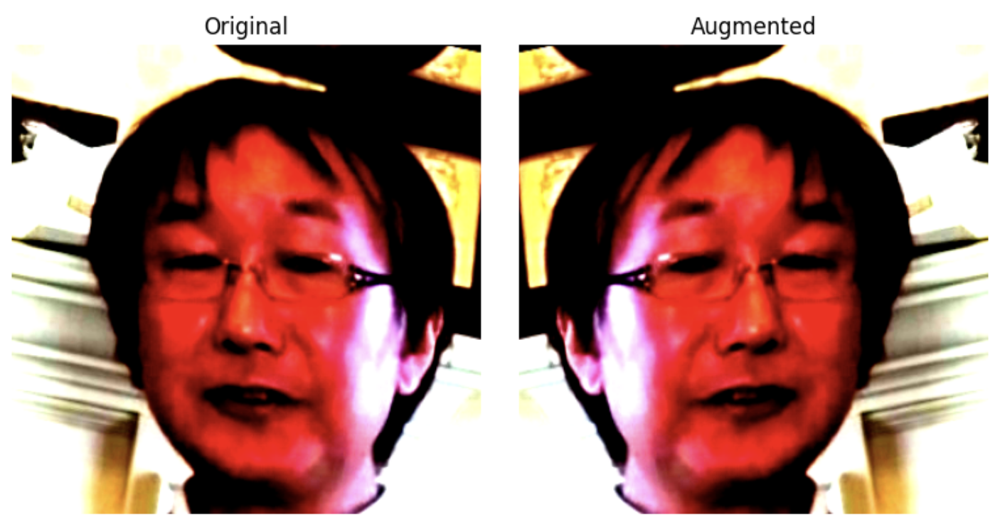
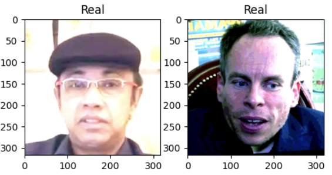
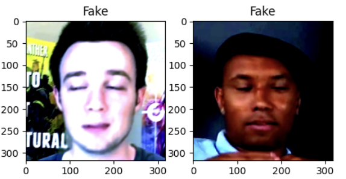
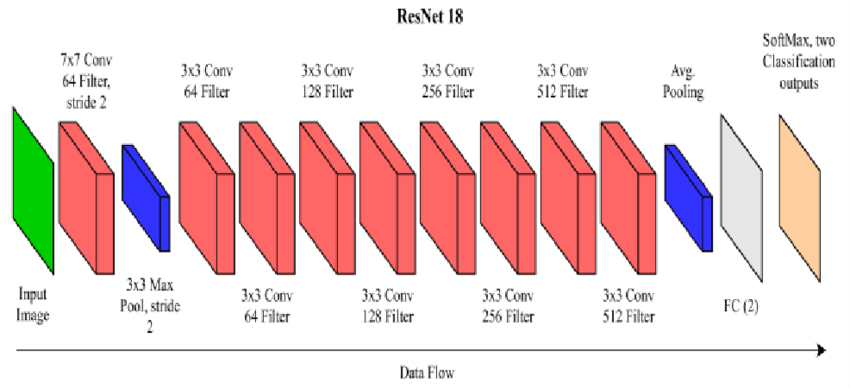
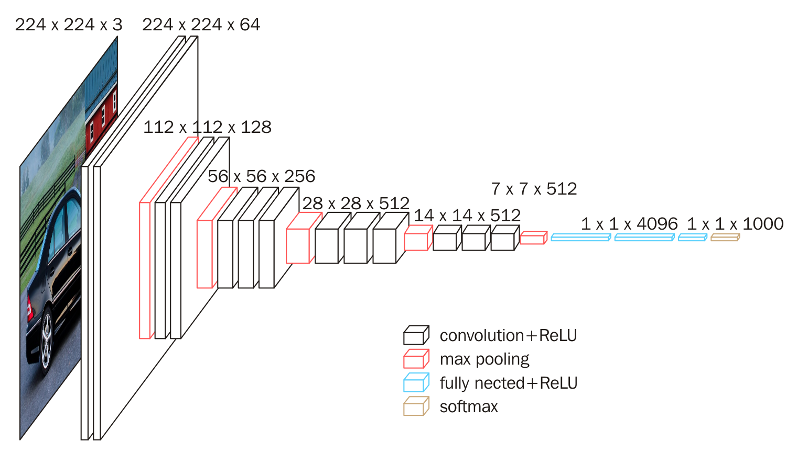
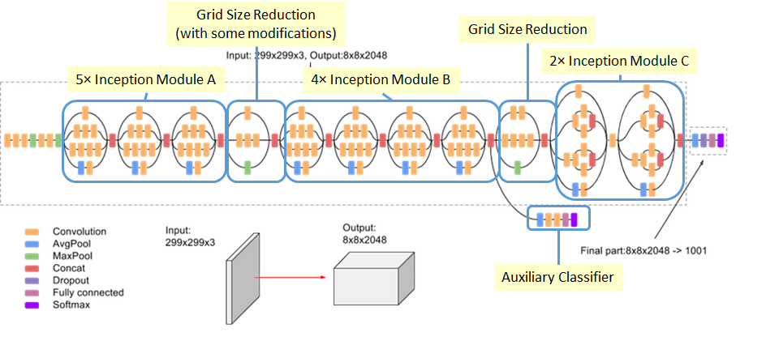
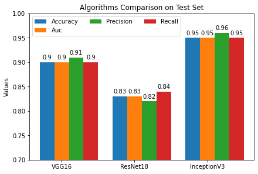
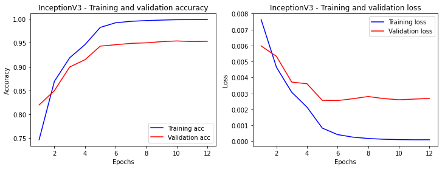
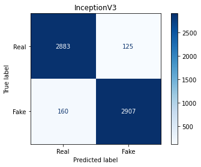

# DeepFake Detection

 [Source Code](cs4487-deepfake-detection.ipynb)

## Introduction

The rapid advancement of deep learning technology has led to a significant increase in the realism of fake content. DeepFake detection has emerged as a crucial area of research to combat the spread of manipulated media. In this report, we present the evaluation of three popular deep neural network models, namely ResNet18, VGG16, and InceptionV3, for the task of DeepFake detection.

## Data Preprocessing

The dataset provided for the DeepFake detection task consists of 55,000 facial images, with a balanced ratio of fake and real images. Each image is in the three-channel format and has a size of 317x317 pixels. Before training the models, several preprocessing steps were applied to ensure the data's suitability for the chosen network models:

```
train_tranform = transforms.Compose([
    transforms.Resize(317),
    transforms.CenterCrop(317),
    transforms.RandomHorizontalFlip(p=0.5), # Randomly flip horizontally
    transforms.ToTensor(),
    transforms.Normalize([0.485, 0.456, 0.406], [0.229, 0.224, 0.225]) # from official  documentation
])
val_tranform = transforms.Compose([
    transforms.Resize(317),
    transforms.CenterCrop(317),
    transforms.ToTensor(),
    transforms.Normalize([0.485, 0.456, 0.406], [0.229, 0.224, 0.225]) # from official  documentation
])
```
> Image Loading: The images were read and loaded using the Python Imaging Library (PIL) library, allowing easy manipulation and processing of the image data.

> Resizing and Cropping: To ensure consistent dimensions across all images, the images were resized and cropped to a uniform size suitable for the chosen models. This step helps in maintaining the integrity of the image content during the training process.

> Normalization: Normalization aids in faster convergence during the model training process and helps avoid issues related to varying pixel value ranges.

> Data Augmentation: To increase the diversity of the training dataset and improve the model's generalization ability, data augmentation techniques were applied. One such technique is horizontal flip, which creates variations by flipping the images horizontally.

### Display original and augmented images



### Display Real and Fake images




## Algorithm Selection
For the DeepFake detection task, three deep neural network models were chosen based on their popularity and performance in image classification tasks:

### ResNet18
> ResNet18 is a relatively lightweight deep neural network architecture with 18 layers. It has shown remarkable performance in various computer vision tasks and has become a widely adopted model due to its simplicity and effectiveness.
```
class ResNetModel(nn.Module):
    def __init__(self):
        super(ResNetModel, self).__init__()
        self.model = models.resnet18(pretrained=True)
        self.model.fc = nn.Linear(self.model.fc.in_features, 2)
        
    def forward(self, x):
        return self.model(x)
```


### VGG16
> VGG16 is a deeper network architecture consisting of 16 layers. It has achieved state-of-the-art performance on several image classification benchmarks. VGG16 is known for its uniform architecture, with small 3x3 filters throughout the network.
```
class VGGModel(nn.Module):
    def __init__(self):
        super(VGGModel, self).__init__()
        self.model = models.vgg16(pretrained=True)
        self.model.classifier[-1] = nn.Linear(self.model.classifier[-1].in_features, 2)

    def forward(self, x):
        return self.model(x)
```


### InceptionV3
> InceptionV3 is a more complex network architecture that incorporates the concept of inception modules, which allow the network to capture information at multiple scales. It has demonstrated excellent performance on large-scale image classification tasks.
```
class InceptionModel(nn.Module):
    def __init__(self):
        super(InceptionModel, self).__init__()
        self.model = models.inception_v3(pretrained=True)
        in_features = self.model.fc.in_features
        self.model.aux_logits = False

    def forward(self, x):
        return self.model(x)
```


## General Settings
```
batch_size = 64
shuffle_dataset = True

# Loss function and optimizer params
learning_rate = 0.0001
epsilon = 1e-08 
weight_decay = 1e-4
momentum = 0.9

# Learning rate decay function params
step_size = 5
gamma = 0.1
```

## Evaluation
To assess the performance of the selected models, they were trained on the entire training set of 55,000 images and evaluated on a separate test set containing 6,075 unseen images. The objective was to obtain a high test accuracy, indicating the model's ability to distinguish between real and fake images.



The evaluation results for the three models are as follows:

ResNet18 accuracy: 0.82
VGG16 accuracy: 0.9
InceptionV3 accuracy: 0.95

Based on these results, it can be observed that all three models achieve reasonably high accuracies on the DeepFake detection task. InceptionV3 outperforms the other models with the highest accuracy of 0.95, indicating its superior ability to discriminate between real and fake images. VGG16 also performs well with an accuracy of 0.9, while ResNet18 achieves a slightly lower accuracy of 0.82.

### Performance of InceptionV3



Training and validation accuracy consistently increase during the training process.​ After around 6 epochs, the validation accuracy shows a slow improvement.​ There is a noticeable gap between the validation loss and the training loss.



### Fine-tuning

To be continued...
