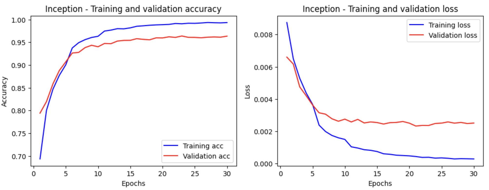

# DeepFake Detection

 [Source Code](cs4487-deepfake-detection.ipynb)

## Introduction

The rapid advancement of deep learning technology has led to a significant increase in the realism of fake content. DeepFake detection has emerged as a crucial area of research to combat the spread of manipulated media. In this report, we present the evaluation of three popular deep neural network models, namely ResNet18, VGG16, and InceptionV3, for the task of DeepFake detection.

## Data Preprocessing

The dataset provided for the DeepFake detection task consists of 55,000 facial images, with a balanced ratio of fake and real images. Each image is in the three-channel format and has a size of 317x317 pixels. Before training the models, several preprocessing steps were applied to ensure the data's suitability for the chosen network models:

```
train_tranform = transforms.Compose([
    transforms.Resize(317),
    transforms.CenterCrop(317),
    transforms.RandomHorizontalFlip(p=0.5), # Randomly flip horizontally
    transforms.ToTensor(),
    transforms.Normalize([0.485, 0.456, 0.406], [0.229, 0.224, 0.225]) # from official  documentation
])
val_tranform = transforms.Compose([
    transforms.Resize(317),
    transforms.CenterCrop(317),
    transforms.ToTensor(),
    transforms.Normalize([0.485, 0.456, 0.406], [0.229, 0.224, 0.225]) # from official  documentation
])
```
> Image Loading: The images were read and loaded using the Python Imaging Library (PIL) library, allowing easy manipulation and processing of the image data.

> Resizing and Cropping: To ensure consistent dimensions across all images, the images were resized and cropped to a uniform size suitable for the chosen models. This step helps in maintaining the integrity of the image content during the training process.

> Normalization: Normalization aids in faster convergence during the model training process and helps avoid issues related to varying pixel value ranges.

> Data Augmentation: To increase the diversity of the training dataset and improve the model's generalization ability, data augmentation techniques were applied. One such technique is horizontal flip, which creates variations by flipping the images horizontally.

### Display original and augmented images


### Display Real and Fake images


## Algorithm Selection
For the DeepFake detection task, three deep neural network models were chosen based on their popularity and performance in image classification tasks:

### ResNet18
> ResNet18 is a relatively lightweight deep neural network architecture with 18 layers. It has shown remarkable performance in various computer vision tasks and has become a widely adopted model due to its simplicity and effectiveness.
```
class ResNetModel(nn.Module):
    def __init__(self):
        super(ResNetModel, self).__init__()
        self.model = models.resnet18(pretrained=True)
        self.model.fc = nn.Linear(self.model.fc.in_features, 2)
        
    def forward(self, x):
        return self.model(x)
```


### VGG16
> VGG16 is a deeper network architecture consisting of 16 layers. It has achieved state-of-the-art performance on several image classification benchmarks. VGG16 is known for its uniform architecture, with small 3x3 filters throughout the network.
```
class VGGModel(nn.Module):
    def __init__(self):
        super(VGGModel, self).__init__()
        self.model = models.vgg16(pretrained=True)
        self.model.classifier[-1] = nn.Linear(self.model.classifier[-1].in_features, 2)

    def forward(self, x):
        return self.model(x)
```


### InceptionV3
> InceptionV3 is a more complex network architecture that incorporates the concept of inception modules, which allow the network to capture information at multiple scales. It has demonstrated excellent performance on large-scale image classification tasks.
```
class InceptionModel(nn.Module):
    def __init__(self):
        super(InceptionModel, self).__init__()
        self.model = models.inception_v3(pretrained=True)
        in_features = self.model.fc.in_features
        self.model.aux_logits = False

    def forward(self, x):
        return self.model(x)
```


## General Settings
```
batch_size = 64
shuffle_dataset = True

# Loss function and optimizer params
learning_rate = 0.0001
epsilon = 1e-08 
weight_decay = 1e-4
momentum = 0.9

# Learning rate decay function params
step_size = 5
gamma = 0.1
```
## Tuning parameters

To further improve the performance of the models, we can tune various hyperparameters. Here are some key parameters that can be tuned:

1. **Learning Rate**: The learning rate determines the step size at which the optimizer updates the model parameters during training. We will try different learning rates to find the optimal value for the specific dataset and model architecture.

2. **Regularization Techniques**: Regularization techniques such as dropout and weight decay can help prevent overfitting. Dropout randomly sets a fraction of input units to zero during training, which helps the model generalize better. Weight decay adds a penalty term to the loss function, encouraging the model to have smaller weights. These techniques can be adjusted by tuning the dropout rate and weight decay factor.

3. **Optimizer**: The choice of optimizer affects how the model parameters are updated during training. Popular optimizers include stochastic gradient descent (SGD), and Adam. Each optimizer has its own hyperparameters, such as momentum, learning rate decay, and weight decay, which can be tuned to improve training performance.

4. **Gamma and Step Size**: Gamma and step size are specific parameters used in learning rate scheduling techniques, such as step decay or exponential decay. Gamma defines the factor by which the learning rate is reduced at each step, while step size determines the number of epochs after which the learning rate is reduced. These parameters can be adjusted to control the learning rate schedule and potentially improve the model's ability to converge.

### Final selected model

| Pre-trained Model | Binary/Multilabel | Learning rate | gamma | Step size | Weight decay | Drop out rate | Best validation accuracy | AUC      |
|-------------------|------------------|---------------|-------|-----------|--------------|---------------|-------------------------|----------|
| InceptionV3       | Binary           | 0.0001        | 0.5   | 5         | 1e-4         | 0.3           | 96.3786                 | 96.34086 |


### Slecting Progress

#### Common parameters

epsilon = 1e-08

momentum = 0.9

criterion = nn.CrossEntropyLoss()

learning scheduler: stepLR

#### First Trial

Due to the long training time, we won't further train the network based on VGG16.

| Pre-trained Model | Input size | Optimizer | Learning rate | gamma | Step size | Weight decay | Drop out | Best epoch | Total epoches | Best validation accuracy |
| --- | --- | --- | --- | --- | --- | --- | --- | --- | --- | --- |
| Resnet18 | 317x317 | Adam | 0.001 | 0.1 | 7 | 1e-4 | 0 | 18 | 20 | 81.0864 |
| VGG16 | 317x317 | SGDM | 0.001 | 0.1 | 7 | 1e-4 | 0 | 15 | 15 | 90.3704 |
| InceptionV3 | 317x317 | Adam | 0.001 | 0.1 | 7 | 1e-4 | 0 | 20 | 20 | 74.6831 |

#### Second Trial

1. Change input size to same as the one pre-train model used for training
2. Make step size and learning rate smaller.
3. Add early stopping.

Observation: accuracy is improved a lot.

| Pre-trained Model | Input size | Optimizer | Learning rate | gamma | Step size | Weight decay | Drop out rate | Best validation accuracy |
| --- | --- | --- | --- | --- | --- | --- | --- | --- |
| Resnet18 | 256x256 | Adam | 0.0001 | 0.1 | 5 | 1e-4 | 0 | 92.164 |
| InceptionV3 | 299x299 | Adam | 0.0001 | 0.1 | 5 | 1e-4 | 0 | 95.390 |

­­

#### Third Trial

Add dropout

| Pre-trained Model | Input size | Optimizer | Learning rate | gamma | Step size | Weight decay | Dropout rate | Best validation accuracy |
| --- | --- | --- | --- | --- | --- | --- | --- | --- |
| Resnet18 | 256x256 | Adam | 0.0001 | 0.1 | 5 | 1e-4 | 0.3 | 93.9588 |
| InceptionV3 | 299x299 | Adam | 0.0001 | 0.1 | 5 | 1e-4 | 0.3 | 95.1112 |

#### Fourth Trial

1. Change the dropout rate from 0.3 to 0.5 on ResNet18
2. Trying to use SGD on ResNet18

Observation: accuracy becomes quite lower.

| Pre-trained Model | Input size | Optimizer | Learning rate | gamma | Step size | Weight decay | Drop out rate | Best validation accuracy |
| --- | --- | --- | --- | --- | --- | --- | --- | --- |
| Resnet18 | 256x256 | SGDM | 0.0001 | 0.1 | 5 | 1e-4 | 0.5 | 60.6420 |
| Resnet18 | 256x256 | Adam | 0.0001 | 0.1 | 5 | 1e-4 | 0.5 | 91.1780 |

#### Fifth Trial

Change gamma,step size,and weight decay for inceptionV3

Observation: accuracy becomes higher.

| Pre-trained Model | Input size | Optimizer | Learning rate | gamma | Step size | Weight decay | Drop out rate | Best validation accuracy |
| --- | --- | --- | --- | --- | --- | --- | --- | --- |
| InceptionV3 | 299x299 | Adam | 0.0001 | 0.5 | 5 | 1e-4 | 0.5 | 96.3786 |
| InceptionV3 | 299x299 | Adam | 0.0001 | 0.5 | 3 | 1e-4 | 0.3 | 96.0329 |
| InceptionV3 | 299x299 | Adam | 0.0001 | 0.5 | 5 | 1e-4 | 0.8 | 95.5612 |
| InceptionV3 | 299x299 | Adam | 0.0001 | 0.5 | 5 | 1e-3 | 0.5 | 96.3045 |

#### Sixth Trial

Multi-label classification

Observation:

For ResNet18, accuracy becomes lower.

For InceptionV3, accuracy becomes higher.

| Pre-trained Model | Input size | Optimizer | Learning rate | gamma | Step size | Weight decay | Drop out rate | Best validation accuracy |
| --- | --- | --- | --- | --- | --- | --- | --- | --- |
| Resnet18 | 256x256 | Adam | 0.0001 | 0.1 | 5 | 1e-4 | 0.3 | 91.7860 |
| InceptionV3 | 299x299 | Adam | 0.0001 | 0.5 | 5 | 1e-4 | 0.3 | 96.4623 |

#### Final Round for best two model

Common setting

| Pre-trained Model | Input size | Optimizer | Learning rate | gamma | Step size | Weight decay | Drop out rate |
| --- | --- | --- | --- | --- | --- | --- | --- |
| InceptionV3 | 299x299 | Adam | 0.0001 | 0.5 | 5 | 1e-4 | 0.3 |

Comparison

| Pre-trained Model | Binary/Multi-label | Best validation accuracy | Test accuracy | Recall | Precision | AUC |
| --- | --- | --- | --- | --- | --- | --- |
| InceptionV3 | Binary | 96.3786 | 96.3457 | 96.837 | 95.9612 | 96.34086 |
| InceptionV3 | Multilabel | 96.4623 | 96.2634 | 95.8265 | 96.7413 | 96.2677 |

#### Final selection:
The multilabel one has higher validation accuracy, and higher recall, indetifying better fake images.
However, the binary one is finally chosen, due to its sightly higher test accuracy and AUC. 


## Evaluation

### Performance of InceptionV3



### Training and Validation Accuracy

During the training process, the accuracy of the model on both the training and validation datasets is an important metric to monitor. 

Initially, as the training progresses, both the training and validation accuracy tend to increase. This indicates that the model is learning and improving its ability to classify the images correctly. 

Around 15 epochs into the training, we observe that the validation accuracy starts to show a slow improvement. This phenomenon is commonly referred to as "convergence slowdown." It indicates that the model has learned most of the relevant patterns in the data, and further improvements in accuracy become smaller with each subsequent epoch.

### Training and Validation Loss

The loss value quantifies the discrepancy between the predicted outputs and the ground truth labels. When examining the training and validation loss, we observe a very small gap between the two values. A small gap between the training and validation losses is generally acceptable. 


## Conclusion

In this project, we utilized multiple pre-trained image classification models, namely ResNet18, VGG16, and InceptionV3, to solve a multilabel classification problem. We trained these models in two ways: binary classification and multilabel classification.

To improve the models' performance, we conducted parameter tuning with a total of 14 trials. We experimented with different hyperparameter configurations and saved the logs for each trial to analyze the results.

The best-performing model, **inceptionV3, achieved an accuracy of 0.96**, and through parameter tuning and utilizing multiple pre-trained models, we aimed to further enhance the models' accuracy and overall performance.
